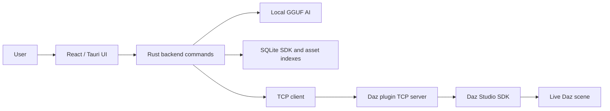

<div align="center">


# DazPilot

**AI-assisted Daz Studio scene control through a local desktop app, a C++ bridge plugin, and on-device AI.**

[](https://github.com/millsydotdev/DazPilot/actions/workflows/ci.yml)
[](https://github.com/millsydotdev/DazPilot/actions/workflows/app-release.yml)
[](https://github.com/millsydotdev/DazPilot/actions/workflows/plugin-release.yml)
[](LICENSE)
[](https://github.com/millsydotdev/DazPilot/releases)
[](https://v2.tauri.app/)
[](https://react.dev/)
[](https://www.typescriptlang.org/)
[](https://www.rust-lang.org/)
[](https://vite.dev/)
[]()

</div>

> **Disclaimer:** DAZPilot is an independent, third-party project and is **not affiliated with, authorized, or endorsed by DAZ3D.** All product names, logos, and brands are property of their respective owners.

---

## Table of Contents

- [Overview](#overview)
- [Features](#features)
- [Architecture](#architecture)
- [Quick Start](#quick-start)
- [Build And Run](#build-and-run)
- [Bridge Protocol](#bridge-protocol)
- [Environment Variables](#environment-variables)
- [Documentation](#documentation)
- [Contributing](#contributing)
- [Security](#security)
- [License](#license)

---

## Overview

DazPilot connects a Tauri desktop app to a live Daz Studio session through a C++ bridge plugin. It uses local AI (GGUF via `llama-server.exe`) to interpret natural-language prompts, plan structured scene actions, and execute them through the Daz SDK. All AI runs on-device by default — no cloud services required.



---

## Features

### Scene Control

- Natural-language scene commands through local AI
- Structured action planning with validation before execution
- Script approval system for safe AI-driven operations
- Session summaries tracking all modifying actions
- **14-agent hierarchy** with task_planner orchestrator and 7 specialized sub-agents

### Daz Studio Bridge

- C++ plugin running a TCP server on `127.0.0.1:8765`
- Newline-delimited JSON protocol with command schema validation
- Main-thread execution proxy using Qt event marshaling
- Commands: scene info, node listing, asset loading, pose application, viewport capture, model import

### Knowledge System

- Recursive SDK header indexing persisted to SQLite
- Daz asset metadata scanning and indexing
- Context-aware AI responses grounded in your actual Daz SDK and library
- **Script IDE**: Built-in script editor with AI-powered generation and execution

### Desktop App

- React + TypeScript frontend with Tailwind CSS
- Chat panel, scene panel, asset browser, viewport canvas, scratchpad
- 24 atomic UI components with a consistent design system
- First-launch wizard for initial setup
- Face tracking Live Link via MediaPipe

### AI Backends

| Backend | Activation | Notes |
| --- | --- | --- |
| Local GGUF (default) | Built-in | Bundled `llama-server.exe`, runs entirely on-device |
| Ollama | `DAZPILOT_AI_BACKEND=ollama` | Optional, for users with Ollama installed |
| Multi-provider | Configuration | OpenAI, Anthropic, Gemini support |

---

## Architecture

| Layer | Responsibility |
| --- | --- |
| **React UI** | App shell, panels, chat, settings, asset browsing, viewport state, agent management UI |
| **Rust backend** | Validation, bridge client, AI orchestration, indexing, persistence, agent hierarchy |
| **Agent system** | 14 agents in tree (task_planner + 6 parent agents + 7 sub-agents), registry, orchestration |
| **Daz bridge plugin** | TCP server and Daz SDK dispatch (C++, owns `:8765`) |
| **Daz Studio SDK** | Scene, nodes, camera, content, viewport, import operations |
| **SQLite** | SDK metadata, asset metadata, session support data |

The Daz plugin owns the TCP server. The app only connects as a client. DazPilot does not silently fake a production bridge.

For detailed architecture docs, see [docs/ARCHITECTURE.md](docs/ARCHITECTURE.md).

---

## Quick Start

### Prerequisites

- **Node.js** 20+
- **Rust** 1.70+
- **CMake** 3.20+
- **Visual Studio Build Tools** (Windows, for C++ bridge plugin)
- **Daz Studio 4.5+** with the SDK installed via Daz Install Manager

### Install and Run

```powershell
# Clone the repository
git clone https://github.com/millsydotdev/DazPilot.git
cd DazPilot

# Install frontend dependencies
npm install

# Build the bridge plugin (requires Daz SDK)
npm run plugin:rebuild

# Start the dev server
npm run dev
```

Copy the built bridge DLL into your Daz Studio plugins folder, then restart Daz Studio:

```powershell
copy plugins\daz3d-bridge\dist\Release\DazPilotBridge.dll "C:\Program Files\DAZ 3D\DAZStudio4\plugins\"
```

Connect from the DazPilot Settings panel to `127.0.0.1:8765`.

For full setup instructions, see [docs/GETTING_STARTED.md](docs/GETTING_STARTED.md).

---

## Build And Run

### 1. Install The Daz Studio SDK

The Daz Studio C++ SDK is proprietary and cannot be hosted on GitHub.

1. Open Daz Install Manager.
2. Search for `Daz Studio SDK` and install it.
3. Place the `DAZStudio4.5+ SDK` folder in the `thirdparty` directory, or set `DAZ_SDK_PATH` to the SDK include path.
4. Keep the SDK out of git. The repository ignore rules are configured for the local SDK folder.

```text
thirdparty/DAZStudio4.5+ SDK\include
```

### 2. Build The Daz Bridge Plugin

```powershell
npm run plugin:rebuild
```

Output:

```text
plugins\daz3d-bridge\dist\Release\
```

### 3. Build The Tauri App

```powershell
npm install
npm run check
npm run tauri build
```

### 4. Run Tests

```powershell
npm test              # Frontend tests
cargo test            # Rust backend tests
npm run check         # Full pipeline: Rust clippy + typecheck + lint + format check + Rust fmt + test
npm run acceptance    # Bridge acceptance tests (mock mode)
```

---

## Bridge Protocol

Requests and responses are newline-delimited JSON.

**Request:**

```json
{ "id": "request-id", "command": "list_nodes", "args": {} }
```

**Success:**

```json
{ "id": "request-id", "status": "ok", "data": {} }
```

**Failure:**

```json
{ "id": "request-id", "status": "error", "error": "message" }
```

### Registered Commands

Bridge commands are organized by category. All **63 commands** are listed below:

| Category | Commands |
| --- | --- |
| **System** | `get_commands` |
| **Scene** | `get_scene_info`, `list_nodes`, `add_node`, `delete_node`, `get_geoshells`, `get_scene_assets`, `save_scene`, `load_scene`, `clear_scene` |
| **Selection** | `get_selected_nodes`, `select_node` |
| **Camera** | `get_cameras`, `set_camera` |
| **Assets** | `load_asset`, `add_figure`, `search_content` |
| **Pose & Morph** | `apply_pose`, `get_figure_morphs`, `set_morph`, `apply_morph`, `get_active_expressions`, `apply_expression`, `get_fitted_items`, `get_material_zones` |
| **Properties** | `set_property`, `get_node_properties`, `get_node_transform`, `set_node_transform` |
| **Materials** | `set_material_property`, `get_material_properties`, `set_material_texture`, `get_material_channels` |
| **Lighting** | `set_light` |
| **Rendering** | `render_preview`, `set_render_settings`, `set_render_options`, `capture_viewport` |
| **Import/Export** | `import_model`, `export_scene` |
| **Animation** | `set_keyframe`, `set_timeline_range`, `seek_to_frame`, `play_timeline`, `pause_timeline`, `stop_timeline`, `get_timeline_state`, `list_keyframes`, `delete_keyframes` |
| **Physics** | `run_dforce_simulation` |
| **Modifiers** | `apply_phy_modifier`, `remove_phy_modifier`, `set_phy_modifier_params`, `list_modifiers` |
| **Viewport** | `viewport_click`, `get_bounding_boxes`, `set_viewport_mode` |
| **Undo** | `begin_undo_batch`, `accept_undo_batch`, `cancel_undo_batch` |
| **Scripting** | `run_script` |
| **Bones** | `list_bones`, `set_bone_transform` |

For the full command schema (parameters, risk level), see the `COMMAND_SCHEMAS` constant in `src-tauri/src/mcp_client.rs`.

For the full protocol spec, see [plugins/daz3d-bridge/README.md](plugins/daz3d-bridge/README.md).

---

## Environment Variables

| Variable | Effect |
| --- | --- |
| `DAZPILOT_DEV_MOCK_BRIDGE=1` | Enable the bridge mock for development |
| `DAZPILOT_DEV_MOCK_AI=1` | Enable the AI mock for development |
| `DAZPILOT_AI_BACKEND=ollama` | Use Ollama instead of bundled local GGUF |
| `DAZ_SDK_PATH=...` | Override the SDK include path |

---

## Documentation

| Document | Description |
| --- | --- |
| [Getting Started](docs/GETTING_STARTED.md) | Step-by-step setup and first build |
| [Architecture](docs/ARCHITECTURE.md) | Runtime flow, bridge ownership, AI flow, and knowledge sources |
| [Current State](docs/CURRENT_STATE.md) | What is implemented, verified, and waiting on live acceptance |
| [Implementation](docs/IMPLEMENTATION.md) | Completed phases and important files |
| [Agents](docs/AGENTS.md) | AI agent responsibilities and message flow |
| [Permissions](docs/PERMISSIONS.md) | Permission model and audit approach |
| [Release Guide](docs/RELEASE_GUIDE.md) | Tagging, CI/CD workflows, signing, and DLL handling |
| [Publishing](docs/PUBLISHING.md) | GitHub and Daz 3D Marketplace publishing notes |
| [Acceptance](docs/ACCEPTANCE.md) | Automated and manual acceptance test checklists |
| [Roadmap](docs/ROADMAP.md) | Planned features, known limitations, and contribution areas |

---

## Contributing

Contributions are welcome. See [CONTRIBUTING.md](CONTRIBUTING.md) for setup instructions, development workflow, and code style guidelines.

```powershell
npm install       # Install dependencies
npm run dev       # Start dev server
npm run check     # Run full validation pipeline
```

---

## Security

To report a security vulnerability, email **security@dazpilot.app**. Do not file public GitHub issues for security reports. See [SECURITY.md](SECURITY.md) for details.

---

## License

DazPilot is licensed under the [MIT License](LICENSE).

---

<div align="center">

**[Getting Started](docs/GETTING_STARTED.md)** · [Architecture](docs/ARCHITECTURE.md) · [Roadmap](docs/ROADMAP.md) · [Contributing](CONTRIBUTING.md) · [Security](SECURITY.md)

</div>
