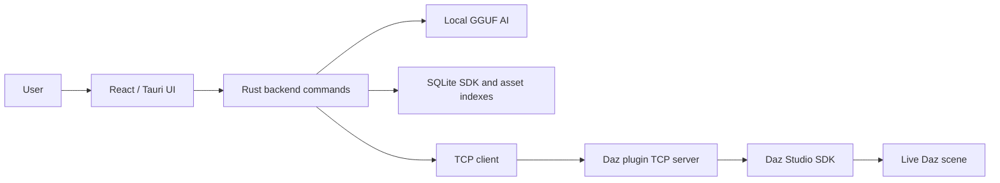

# DazPilot

> **Disclaimer:** DazPilot is an independent, third-party project and is **not affiliated with, authorized, or endorsed by Daz 3D.** All product names, logos, and brands are property of their respective owners.

AI-assisted Daz Studio scene control through a Tauri desktop app, a local GGUF model, a Daz SDK knowledge index, and a C++ bridge plugin.

## At A Glance

| Area | Current shape |
| --- | --- |
| Desktop app | React, TypeScript, Vite, and Tauri |
| Daz bridge | C++ plugin TCP server on `127.0.0.1:8765` |
| App bridge role | Tauri connects as a TCP client |
| Protocol | Newline-delimited JSON |
| Default AI | Bundled local GGUF through `llama-server.exe` |
| Optional AI | Ollama via `DazPilot_AI_BACKEND=ollama` |
| Knowledge store | Recursive SDK and asset metadata indexes persisted to SQLite |

## Runtime Shape



DazPilot does not silently fake a production bridge. The Daz Studio plugin owns the bridge server, and the app connects to it. Development mocks are explicit:

- `DazPilot_DEV_MOCK_BRIDGE=1` enables the bridge mock.
- `DazPilot_DEV_MOCK_AI=1` enables the AI mock.
- `DazPilot_AI_BACKEND=ollama` selects Ollama instead of the bundled local GGUF path.

## Bridge Protocol

Requests and responses are newline-delimited JSON.

```json
{ "id": "request-id", "command": "list_nodes", "args": {} }
```

Success:

```json
{ "id": "request-id", "status": "ok", "data": {} }
```

Failure:

```json
{ "id": "request-id", "status": "error", "error": "message" }
```

Registered bridge commands include `get_scene_info`, `list_nodes`, `get_selected_nodes`, `select_node`, `get_cameras`, `load_asset`, `apply_pose`, `render_preview`, `capture_viewport`, `import_model`, and `export_scene`.

`export_scene` currently returns an explicit unsupported response until a real Daz SDK exporter is prioritized.

## Build And Run

### 1. Install The Daz Studio SDK

The Daz Studio C++ SDK is proprietary and cannot be hosted on GitHub.

1. Open Daz Install Manager.
2. Search for `Daz Studio SDK` and install it.
3. Place the `DAZStudio4.5+ SDK` folder in the repository root, or set `DAZ_SDK_PATH` to the SDK include path.
4. Keep the SDK out of git. The repository ignore rules are configured for the local SDK folder.

Common local SDK include path:

```text
DAZStudio4.5+ SDK\include
```

### 2. Build The Daz Bridge Plugin

```powershell
npm run plugin:rebuild
```

The release DLL is produced under:

```text
plugins\daz3d-bridge\dist\Release\
```

Copy the bridge DLL into the Daz Studio plugin folder, then restart Daz Studio.

Common plugin folder:

```text
C:\Program Files\DAZ 3D\DAZStudio4\plugins\
```

### 3. Build The Tauri App

```powershell
npm install
npm run check
npm run tauri build
```

After Daz Studio is running with the plugin enabled, connect from the app Settings panel to `127.0.0.1:8765`.

## Documentation

| Guide | Purpose |
| --- | --- |
| [Current State](docs/CURRENT_STATE.md) | What is real now, what is verified, and what still needs live acceptance |
| [Architecture](docs/ARCHITECTURE.md) | Runtime flow, bridge ownership, AI flow, and knowledge sources |
| [Implementation](docs/IMPLEMENTATION.md) | Completed phase list and remaining validation work |
| [Release Guide](docs/RELEASE_GUIDE.md) | Tagging, GitHub Actions releases, signing, and bundled DLL handling |
| [Publishing](docs/PUBLISHING.md) | GitHub and Daz 3D Marketplace publishing notes |
| [Permissions](docs/PERMISSIONS.md) | Permission model and audit approach |
| [Agents](docs/AGENTS.md) | AI agent responsibilities and message flow |

## Acceptance Notes

All planned implementation phases are complete, but live Daz Studio acceptance still needs to verify plugin installation, asset loading, pose application, import coverage, viewport capture, and real-scene behavior.
