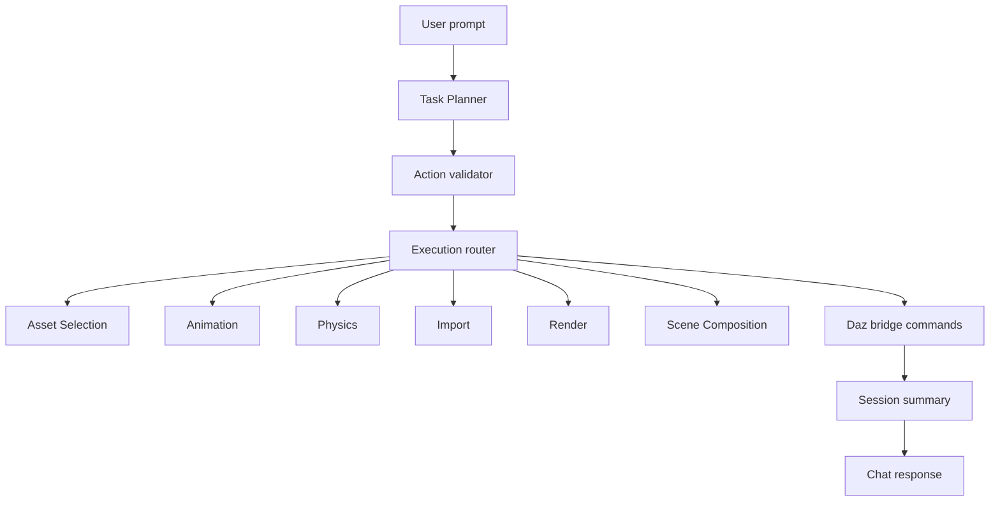

## Anchored Summary

**Goal**: Fully automated AI-powered Daz3D scene creation using user-owned assets with complete SDK integration, asset scanning, and natural language scene composition.

**Current rating**: ~85%

## Achieved

- **64 bridge commands** (all implemented in C++ plugin + Rust schemas, parity enforced by test)
- **Bridge DLL compiled** (511KB, deployed to `src-tauri/resources/`)
- **Reasoning engine**: Planner, Validator, Learner, Executor, Explainer — maps natural language goals → workflow plans → bridge command sequences
- **Knowledge system**: 6 knowledge bases — Daz concepts, scene composition, asset semantics, workflow templates, failure patterns, command reference (all 63 commands documented)
- **Workflow templates**: 9 types — CreateScene (14 steps), CreateCharacter, CreateOutfit, SetupLighting (3-point), PoseCharacter, AnimateCharacter, RenderStill, RenderAnimation, FixCommonIssue
- **Agent system**: 10 specialized agent roles (Task Planner, Asset Selection, Animation, Physics, etc.)
- **All tests pass**: 497 JS + 83 Rust, zero compilation errors, zero warnings
- **AI backends**: Local GGUF, Ollama, OpenAI/Anthropic/Gemini
- **MCP schema parity**: C++ bridge ↔ Rust schemas enforced by automated test
- **Command knowledge**: 63 commands with parameter specs, SDK refs, usage notes for AI reference

## Remaining (~15%)

1. **Set `GH_PAT` secret** in GitHub repo settings (needed for CI to clone private thirdparty SDK submodule)
2. **Live Daz acceptance** — install DLL, run bridge, execute acceptance checklist
3. **Real asset scanning** — run library scanner against actual Daz content
4. **Agent prompt tuning** — refine LLM prompts for professional-quality output

## Next Action

Set `GH_PAT` → tag `plugin-v*` → CI builds DLLs for Win/Mac/Linux → download artifacts → deploy to Daz → run acceptance.

---

# AI Agent System

Updated: May 2026

## Overview

DazPilot uses specialized AI service roles to interpret user requests, choose assets, plan scene actions, and summarize outcomes. The runtime goal is simple: convert natural language into validated, reviewable Daz operations.

## Agent Map



## Core Responsibilities

| Role | Purpose | Typical output |
| --- | --- | --- |
| Task Planner | Parse user intent and create executable steps | Structured action plan |
| Asset Selection | Match natural language to indexed user assets | Ranked asset candidates |
| Animation | Apply poses, keyframes, and timeline operations | Animation steps |
| Physics | Configure and run dForce-style simulation workflows | Simulation plan or result |
| Conflict Resolution | Detect asset, material, or scene conflicts | Proposed fixes |
| Import | Route supported model imports | Import command payload |
| Render | Configure preview or render operations | Render command payload |
| Learning | Track decisions and user responses | Preference updates |
| Image Reference | Analyze visual references | Style or composition hints |
| Scene Composition | Arrange elements, lighting, and camera intent | Scene layout plan |

## Execution Flow

1. The task planner parses the prompt.
2. The planner proposes one or more structured actions.
3. The backend validates commands and arguments against the registered schema.
4. High-risk actions require confirmation.
5. Safe actions execute through the Daz bridge.
6. Results are written into the session summary queue.
7. The chat response summarizes what happened and what still needs attention.

## Message Shape

```typescript
type AgentMessageType = "request" | "response" | "broadcast" | "error" | "complete";

interface AgentMessage<TPayload = unknown> {
  id: string;
  type: AgentMessageType;
  from: string;
  to?: string;
  payload: TPayload;
  createdAt: string;
}
```

## Task Shape

```typescript
interface Task {
  id: string;
  command: string;
  intent: ParsedIntent;
  steps: TaskStep[];
  assignedAgents: string[];
  status: TaskStatus;
  result?: TaskResult;
}

interface TaskStep {
  id: number;
  agent: string;
  action: string;
  params: object;
  dependsOn: number[];
  status: StepStatus;
}
```

## Error Handling

| Strategy | When it applies |
| --- | --- |
| Retry | Transient bridge, AI, or indexing failure |
| Fallback | Another route can safely complete the user goal |
| Partial execution | Some validated steps succeeded and some were skipped |
| Human confirmation | The operation is risky, ambiguous, or destructive |
| Honest failure | The requested Daz SDK operation is not implemented |

## Adding A New Agent

1. Add the service or agent module in the relevant backend area.
2. Define its input and output shape.
3. Register it with the planner or router.
4. Add schema validation before bridge execution.
5. Add tests around planning, validation, and failure behavior.

## Metrics To Track

| Metric | Why it matters |
| --- | --- |
| Total executions | Shows usage and hot paths |
| Success rate | Measures reliability |
| Average time | Highlights slow operations |
| Confidence score | Helps decide when to ask for confirmation |
| Last executed | Helps debug stale or unused paths |
