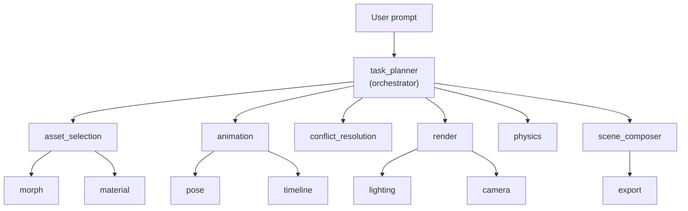

## Anchored Summary

**Goal**: Fully automated AI-powered Daz3D scene creation using user-owned assets with complete SDK integration, asset scanning, and natural language scene composition.

**Current rating**: ~90%

## Achieved

- **63 bridge commands** (all implemented in C++ plugin + Rust schemas, parity enforced by test)
- **Bridge DLL compiled** (511KB, deployed to `src-tauri/resources/`)
- **Reasoning engine**: Planner, Validator, Learner, Executor, Explainer — maps natural language goals → workflow plans → bridge command sequences
- **Knowledge system**: 6 knowledge bases — Daz concepts, scene composition, asset semantics, workflow templates, failure patterns, command reference (all 63 commands documented)
- **Workflow templates**: 9 types — CreateScene (14 steps), CreateCharacter, CreateOutfit, SetupLighting (3-point), PoseCharacter, AnimateCharacter, RenderStill, RenderAnimation, FixCommonIssue
- **Agent system**: 14 agents in a 3-level hierarchy with registry, orchestration, and delegation
- **All tests pass**: 497 JS + 119 Rust, zero compilation errors, zero warnings
- **Heuristic planner**: 12 keyword-based functions (seek frame, timeline, dforce, keyframe, morph, light, render, add figure, create scene, create light, apply expression, load asset, export) for instant action resolution without LLM
- **LLM prompt enhancement**: Inline usage notes for 14 key bridge commands + scenario-specific guidance (scene, render, lighting, pose, morph) in `build_tool_planning_prompt`
- **AI backends**: Local GGUF, Ollama, OpenAI/Anthropic/Gemini
- **MCP schema parity**: C++ bridge ↔ Rust schemas enforced by automated test
- **Command knowledge**: 63 commands with parameter specs, SDK refs, usage notes for AI reference
- **Sub-agent hierarchy**: 7 sub-agents under 3 parent agents (animation, render, asset_selection, scene_composer) in a 3-level tree
- **Agent registry**: Dynamic registration, unregistration, tree querying, capability-based lookup
- **Delegation orchestration**: Parent→child delegation with cycle detection, depth limits, results aggregation
- **Automated conflict resolution pipeline**: Intent-aware conflict detection and auto-fix for shell zones, morph IDs, UV sets, and compatibility — integrated across `asset_fixer`, `vision_service`, `conflict_resolution` agent, and pre-load checks

## Remaining (~10%)

1. **Set `GH_PAT` secret** in GitHub repo settings (needed for CI to clone private thirdparty SDK submodule)
2. **Live Daz acceptance** — install DLL, run bridge, execute acceptance checklist
3. **Real asset scanning** — run library scanner against actual Daz content
4. **Agent prompt tuning** — refine LLM prompts for professional-quality output

## Next Action

Set `GH_PAT` → tag `plugin-v*` → CI builds DLLs for Win/Mac/Linux → download artifacts → deploy to Daz → run acceptance.

---

# AI Agent System

Updated: May 2026

## Overview

DazPilot uses a **hierarchical multi-agent system** to interpret user requests, choose assets, plan scene actions, and summarize outcomes. Agents are organized in a tree structure with parent→child delegation. The runtime goal is simple: convert natural language into validated, reviewable Daz operations.

## Agent Hierarchy



## Agent Registry (14 agents)

All agents are registered in a tree structure via `AgentRegistry`. Each agent has a type, description, parent, children, capabilities, and a handler function.

### Root Level

| Agent | Description | Capabilities |
| --- | --- | --- |
| `task_planner` | Primary orchestrator: parses intent and delegates to specialized agents | orchestrator, planner, delegate, coordinate |

### Level 1 (children of task_planner)

| Agent | Description | Capabilities |
| --- | --- | --- |
| `asset_selection` | Searches and selects assets using semantic and multi-strategy matching | load, apply, find, search, asset, content |
| `animation` | Controls timeline, poses, keyframes, and dForce simulation | pose, animation, timeline, keyframe, dforce, play, pause |
| `conflict_resolution` | Intent-aware conflict detection and auto-fix for shell zones, morph IDs, UV sets, and compatibility (uses `asset_fixer`, `vision_service`, and `get_geoshells` bridge command) | conflict, fix, issue, shell, uv |
| `render` | Configures render settings, lights, and triggers preview renders | render, light, lighting, preview, 4k, hd |
| `physics` | Configures and runs dForce physics simulations | simulate, dforce, physics, simulation |
| `scene_composer` | Composes multi-step scene creation from high-level descriptions | compose, scene, environment, setup |

### Level 2 (sub-agents)

| Agent | Parent | Description | Capabilities |
| --- | --- | --- | --- |
| `morph` | asset_selection | Applies figure morphs and facial expressions | morph, expression, shape, facial, adjust |
| `material` | asset_selection | Manages material properties, textures, and shader channels | material, texture, shader, surface, color |
| `pose` | animation | Handles pose application, searching, and listing | pose, apply pose, posing |
| `timeline` | animation | Controls animation timeline: play, pause, stop, seek, keyframes, loop | play, pause, stop, timeline, keyframe, seek, loop |
| `lighting` | render | Manages scene lights: add, remove, adjust intensity and color | light, lighting, bright, dim, warm, cool |
| `camera` | render | Controls camera views, focal length, and framing | camera, view, shot, angle, zoom |
| `export` | scene_composer | Handles scene export, batch export, and render output | export, save, output, batch |

## Execution Flow

1. **Registration** — `register_default_agents()` initializes all 14 agents in the registry at app startup.
2. **Orchestration** — The `task_planner` receives the user prompt and iterates its registered children.
3. **Capability matching** — Each child is checked: does its capabilities list contain keywords from the input?
4. **Delegation** — Matched children receive the request via `orchestrator::delegate_to_child()`, which:
   - Validates the child is actually registered under the parent
   - Checks for circular delegation (prevents infinite loops)
   - Enforces `max_delegation_depth` (default: 5)
   - Appends to the `delegation_chain` for traceability
5. **Execution** — Each delegated agent runs its handler and returns `AgentResponse` with actions.
6. **Aggregation** — The orchestrator collects all actions, deduplicates by command name, and returns a combined response.
7. **Fallback** — If no agent matched, a general `parse_and_create_actions()` provides default chat handling.
8. **Summary** — The chat response summarizes what each agent did.

## Data Structures

### AgentRequest

```rust
pub struct AgentRequest {
    pub agent_type: String,          // Which agent to invoke
    pub input: String,               // Natural language input
    pub context: Option<AgentContext>, // Scene/user context
    pub delegation_chain: Vec<String>, // Path from root to current agent
    pub max_delegation_depth: u32,   // Prevent infinite recursion (default: 5)
}
```

### AgentResponse

```rust
pub struct AgentResponse {
    pub success: bool,
    pub result: Option<String>,
    pub error: Option<String>,
    pub actions: Vec<AgentAction>,             // Commands to execute
    pub sub_results: Vec<SubAgentResult>,       // Results from delegated sub-agents
}
```

### SubAgentResult

```rust
pub struct SubAgentResult {
    pub agent_type: String,
    pub success: bool,
    pub result: Option<String>,
    pub error: Option<String>,
    pub actions: Vec<AgentAction>,
}
```

### AgentNode (in registry)

```rust
pub struct AgentNode {
    pub agent_type: String,
    pub description: String,
    pub parent: Option<String>,
    pub children: Vec<String>,
    pub capabilities: Vec<String>,
    pub handler: fn(AgentRequest) -> AgentResponse,
}
```

## Registry API

The `AgentRegistry` singleton provides these operations:

| Method | Description |
| --- | --- |
| `register(node)` | Add an agent node, linking parent→child |
| `unregister(agent_type)` | Remove an agent, re-parenting its children |
| `get(agent_type)` | Look up an agent by type |
| `get_children(agent_type)` | Get all direct children |
| `get_parent(agent_type)` | Get the parent agent |
| `get_descendants(agent_type)` | Get all descendants recursively |
| `get_ancestors(agent_type)` | Get all ancestors up to root |
| `list_agents()` | List all agents with metadata |
| `find_by_capability(capability)` | Find agents that handle a capability |
| `find_by_input(input)` | Rank agents by keyword match count |
| `get_agent_tree()` | Full nested tree as JSON |
| `print_tree()` | Human-readable tree string |

## Orchestrator API

| Function | Description |
| --- | --- |
| `delegate_to_child(parent, child, request)` | Delegate to a specific child agent |
| `delegate_by_capability(parent, input, request)` | Delegate to all matching children |
| `delegate_and_aggregate(parent, input, request)` | Delegate + combine all results |

## Agent Management Commands (Tauri)

The following Tauri commands are available for frontend agent interaction:

| Command | Returns | Description |
| --- | --- | --- |
| `list_agents()` | `Vec<AgentInfo>` | List all agents with metadata |
| `get_agent_info(agentType)` | `AgentInfo \| null` | Get a specific agent's details |
| `get_agent_tree()` | `Vec<AgentTreeNode>` | Full nested tree with capabilities |
| `test_agent(agentType, input)` | `AgentResponse` | Run any agent with test input |
| `execute_agent(agentType, input)` | `AgentResponse` | Execute an agent by type |
| `execute_sub_agent(parent, child, input)` | `AgentResponse` | Direct parent→child delegation |
| `register_sub_agent(type, desc, parent, caps)` | `String` | Dynamically register a new sub-agent |
| `unregister_agent(agentType)` | `String` | Remove an agent from the registry |

## Frontend Components

Three React components provide agent visualization and testing:

| Component | Description |
| --- | --- |
| `AgentTreeView` | Collapsible tree showing the full agent hierarchy |
| `AgentDetailPanel` | Shows selected agent's capabilities, parent, children, and status |
| `AgentTester` | Text input + Run button to test any agent and see structured results |

## Sub-Agent Capabilities

### morph
- Set figure morphs by name (Head_Height, Waist_Width, etc.)
- Apply facial expressions (Smile, Frown, Surprise, etc.)
- List available expressions

### material
- Set material channel properties (Base Color, Roughness, Metallic, etc.)
- Apply texture maps to channels
- Reset materials to defaults

### pose
- Apply poses to figures
- Search pose library by keyword
- List available poses

### timeline
- Play, pause, stop animation timeline
- Seek to specific frame
- Set timeline range
- Set keyframes with interpolation
- Toggle loop

### lighting
- Add lights (point, spot, distant, area)
- Remove lights
- Adjust intensity (bright/dim)
- Set color (warm/cool)
- Enable/disable lights

### camera
- Set camera view (front, side, top, perspective, etc.)
- Adjust focal length (wide 35mm → tele 200mm)
- Set focal distance

### export
- Export scene (FBX, OBJ, DUF, USD, GLB, PNG)
- Batch export
- Render preview for export

## Conflict Resolution Agent

The `conflict_resolution` agent is intent-aware — it parses user input to determine the action:

| Intent Keywords | Behavior |
| --- | --- |
| scan, detect, check | Runs `vision_service::detect_asset_conflicts_from_scene()` and reports results with no auto-fix |
| fix, resolve, repair, auto-fix | Runs detection then generates fix actions for all conflict types |
| status, report, summary | Returns a summary count of conflicts without scanning again |
| (none of the above) | Runs full pipeline: detect conflict type, generate appropriate fix/warn actions |

### Conflict Types Handled

| Conflict Type | Detection | Auto-Fix |
| --- | --- | --- |
| `MaterialZone` / `Multiple_Shells_Detected` | File-level duplicate material zone IDs via `asset_fixer::scan_asset_conflicts()` + bridge `get_geoshells` | Prefix material zone IDs with heuristic prefix (GM_, GMin_, GA_, BR_, NP_, AR_, FIXED_) |
| `MorphId` | Cross-file duplicate morph IDs via `asset_fixer::scan_asset_conflicts()` | Prefix duplicate morph IDs per file with unique prefix (FX_1_, FX_2_, etc.) |
| `UVSet` | File-level duplicate UV set names via `asset_fixer::scan_asset_conflicts()` | Prefix duplicate UV set names with heuristic prefix |

### Pre-Load Checks

`load_asset_in_daz` automatically calls `conflict_resolution::check_before_load()` before executing the bridge `load_asset` command. If conflicts are detected in the asset's parent directory, a warning is appended to the load result.

## Adding A New Agent

1. Create a new file in `src-tauri/src/agents/sub_agents/` with a `pub fn execute(AgentRequest) -> AgentResponse`
2. Add the module to `agents/sub_agents/mod.rs`
3. Add the handler mapping in `agents/mod.rs` `register()` function
4. Add a `register()` call in `register_default_agents()` with the correct parent and capabilities
5. Add `sub_results: vec![]` to all `AgentResponse` constructors in the new file

## Metrics To Track

| Metric | Why it matters |
| --- | --- |
| Total executions per agent | Shows usage and hot paths |
| Success rate per agent | Measures reliability |
| Average response time | Highlights slow agents |
| Confidence score | Helps decide when to ask for confirmation |
| Delegation depth | Detects overly deep chains |
