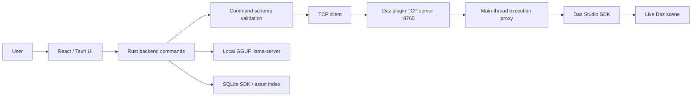

# Architecture

Updated: May 2026

## System Map



## Runtime Responsibilities

| Layer | Owns | Notes |
| --- | --- | --- |
| React UI | App shell, panels, chat, settings, asset browsing, viewport state | Talks to Tauri commands |
| Rust backend | Validation, bridge client, AI orchestration, indexing, persistence | Does not own the Daz TCP server |
| Daz bridge plugin | TCP server and Daz SDK dispatch | Listens on `127.0.0.1:8765` |
| Daz Studio SDK | Scene, nodes, camera, content, viewport, import operations | Must be touched from the Daz main thread for unsafe operations |
| SQLite | SDK metadata, asset metadata, session support data | Populated by recursive scanners |

## Bridge Ownership

The Daz plugin owns the TCP server. The app only connects as a client.

| Field | Value |
| --- | --- |
| Host | `127.0.0.1` |
| Port | `8765` |
| Format | Newline-delimited JSON |
| Request | `{ "id": "string", "command": "list_nodes", "args": {} }` |
| Success | `{ "id": "string", "status": "ok", "data": {...} }` |
| Failure | `{ "id": "string", "status": "error", "error": "message" }` |

## Main-Thread Execution

Daz Studio's SDK is single-threaded in practice. Scene mutations and DazScript evaluation must run on Daz Studio's main GUI thread. Executing those operations directly from a TCP worker thread can crash or destabilize Daz Studio.

The bridge uses a Qt event-based proxy:

1. `ScriptExecutor`, a `QObject`, is created on Daz Studio's main thread during plugin initialization.
2. The TCP receive thread builds a thread-safe event containing the script payload and arguments.
3. The receive thread posts that event with `QCoreApplication::postEvent`.
4. Daz Studio's main thread evaluates the script and stores the result.
5. A condition variable wakes the TCP thread so it can write the bridge response.

## AI Flow

Chat is action-aware rather than text-only:

1. Infer a structured action when possible.
2. Validate the action against the registered bridge command schema.
3. Require confirmation for high-risk actions.
4. Execute safe actions through the Daz bridge.
5. Summarize the outcome with the local GGUF model.

Ollama remains available only when explicitly selected with `DazPilot_AI_BACKEND=ollama`.

## Knowledge Sources

| Source | Purpose |
| --- | --- |
| `src-tauri/src/sdk_indexer.rs` | Recursively indexes SDK headers |
| `src-tauri/src/library_scanner.rs` | Reads Daz asset metadata where available |
| SQLite `sdk_classes` | SDK class metadata |
| SQLite `sdk_methods` | SDK method metadata |
| SQLite `sdk_enums` | SDK enum metadata |
| SQLite `user_assets` | Discovered user assets |

The default SDK include path is:

```text
DAZStudio4.5+ SDK\include
```

Use `DAZ_SDK_PATH=...` to override it.

## Session Summaries

The Rust backend keeps a transactional session summary queue so the UI and AI can stay aware of completed modifying actions.

- Successful modifying scene actions enqueue an event summary with `enqueue_summary_event`.
- The frontend can query the current session history through the `get_session_summary` Tauri command.

## Development Flags

| Flag | Effect |
| --- | --- |
| `DazPilot_DEV_MOCK_BRIDGE=1` | Enables the explicit bridge mock for development |
| `DazPilot_DEV_MOCK_AI=1` | Enables the explicit AI mock for development |
| `DazPilot_AI_BACKEND=ollama` | Uses Ollama instead of bundled local GGUF |
| `DAZ_SDK_PATH=...` | Overrides the SDK include path |

## Unsupported Operations

The bridge rejects unsupported Daz operations instead of pretending they succeeded. Current unsupported plugin operation: scene export.
