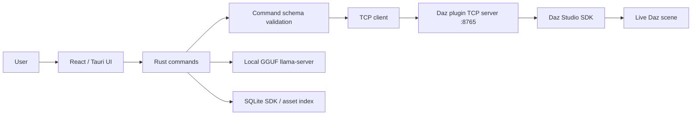

# Architecture

## Runtime Flow

## Bridge Ownership

The Daz plugin owns the TCP server. The app only connects as a client.

- Host: `127.0.0.1`
- Port: `8765`
- Format: newline-delimited JSON
- Request: `{ "id": "string", "command": "list_nodes", "args": {} }`
- Success: `{ "id": "string", "status": "ok", "data": {...} }`
- Failure: `{ "id": "string", "status": "error", "error": "message" }`

## Scripting & Main-Thread Execution

Daz Studio's SDK is single-threaded; any operations modifying the scene or evaluating DazScript must run on Daz Studio's main GUI thread. Attempting to execute scripts directly from a TCP worker thread will result in immediate crashes or unstable behavior.

To solve this, the bridge uses a Qt event-based main-thread execution proxy:
1. A C++ class `ScriptExecutor` (inheriting from `QObject`) is instantiated on Daz Studio's main thread during plugin initialization.
2. When the bridge receive thread receives a `run_script` command, it constructs a thread-safe `RunScriptEvent` containing the DazScript payload and arguments.
3. The receive thread posts this event to the `ScriptExecutor` queue via `QCoreApplication::postEvent`.
4. Daz Studio's main thread picks up the event, evaluates the script, writes the result to a shared response pointer, and triggers a `std::condition_variable` to signal the TCP thread that the evaluation is complete.
5. The TCP thread wakes up and writes the result back over the socket bridge.

## Transactional Session Summaries

To keep the user and AI fully informed during operations, the Rust backend maintains a persistent transactional session summary queue.
* Whenever a modifying scene action is successfully executed, the Rust side enqueues an event summary using `enqueue_summary_event`.
* The frontend can query the complete history of operations within the current session using the `get_session_summary` Tauri command.

## AI Flow

Chat is no longer text-only by default:

1. Infer a structured action when possible.
2. Validate the action against bridge command schema.
3. Mark high-risk actions as requiring confirmation.
4. Execute safe actions through the Daz bridge.
5. Summarize outcome with local GGUF.

Ollama remains available only when explicitly selected with `DazPilot_AI_BACKEND=ollama`.

## Knowledge Sources

- SDK headers are indexed by `sdk_indexer`.
- Default SDK path is `E:\DazPilot\DAZStudio4.5+ SDK\include`.
- The index includes class, method, enum, parent, file, and line metadata.
- Results are persisted to SQLite tables `sdk_classes`, `sdk_methods`, and `sdk_enums`.
- Asset scanning reads metadata from Daz files when possible and persists to `user_assets`.

## Dev Flags

- `DazPilot_DEV_MOCK_BRIDGE=1`: explicit bridge mock for development.
- `DazPilot_DEV_MOCK_AI=1`: explicit AI mock for development.
- `DazPilot_AI_BACKEND=ollama`: use Ollama instead of bundled local GGUF.
- `DAZ_SDK_PATH=...`: override SDK include path.

## Honest Unsupported Operations

The bridge rejects unsupported Daz operations instead of faking success. Current unsupported plugin operation: scene export.
