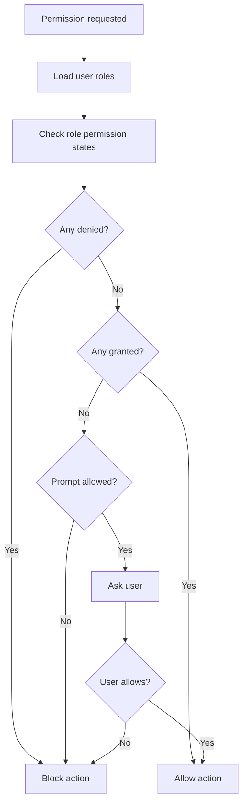

# Permission System

Updated: May 2026

## Overview

DazPilot uses a database-driven permission model for feature access, AI actions, Daz operations, and sensitive runtime prompts. The intent is to keep powerful scene actions explicit, auditable, and configurable.

## Principles

| Principle | Meaning |
| --- | --- |
| Dynamic discovery | Permissions are loaded from storage, not scattered as hardcoded checks |
| Role-based access | Users receive permissions through roles |
| Runtime prompts | Sensitive actions can require explicit confirmation |
| Audit logging | Permission checks and changes are recorded for review |
| Least privilege | Unknown or sensitive operations should default to prompt or deny |

## Permission Categories

| Category | Description |
| --- | --- |
| `SYSTEM` | Core application settings and administration |
| `FEATURE` | UI features and workflow access |
| `ASSET` | Asset library scan, browse, and usage |
| `OPERATION` | Import, export, render, and scene mutation |
| `AI` | AI planning, auto-apply, and learning behavior |
| `DAZ3D` | Daz Studio bridge and plugin interaction |
| `NETWORK` | Cloud or external network features |
| `RUNTIME` | Session-scoped decisions |

## Database Schema

### Permission Definitions

```sql
CREATE TABLE permissions (
    id TEXT PRIMARY KEY,
    name TEXT UNIQUE NOT NULL,
    description TEXT,
    category TEXT NOT NULL,
    default_state TEXT DEFAULT 'prompt',
    requires_prompt BOOLEAN DEFAULT false,
    created_at DATETIME DEFAULT CURRENT_TIMESTAMP
);
```

### User Roles

```sql
CREATE TABLE user_roles (
    id TEXT PRIMARY KEY,
    name TEXT NOT NULL,
    description TEXT,
    is_admin BOOLEAN DEFAULT false,
    inherit_from TEXT,
    created_at DATETIME DEFAULT CURRENT_TIMESTAMP
);
```

### Role Permissions

```sql
CREATE TABLE role_permissions (
    role_id TEXT NOT NULL,
    permission_id TEXT NOT NULL,
    state TEXT NOT NULL,
    conditions TEXT,
    PRIMARY KEY (role_id, permission_id)
);
```

Allowed `state` values are `granted`, `denied`, and `prompt`.

### Role Assignments

```sql
CREATE TABLE user_role_assignments (
    user_id TEXT NOT NULL,
    role_id TEXT NOT NULL,
    assigned_at DATETIME DEFAULT CURRENT_TIMESTAMP,
    PRIMARY KEY (user_id, role_id)
);
```

### Audit Log

```sql
CREATE TABLE permission_audit (
    id INTEGER PRIMARY KEY AUTOINCREMENT,
    user_id TEXT NOT NULL,
    permission_id TEXT NOT NULL,
    action TEXT NOT NULL,
    result TEXT NOT NULL,
    ip_address TEXT,
    context TEXT,
    timestamp DATETIME DEFAULT CURRENT_TIMESTAMP
);
```

## Default Roles

### Basic User

| Permission | Default | Notes |
| --- | --- | --- |
| `feature.scene.create` | `granted` | Can create scenes |
| `feature.scene.save` | `granted` | Can save scenes |
| `feature.library.scan` | `granted` | Can scan the local library |
| `feature.library.browse` | `granted` | Can browse indexed assets |
| `feature.animation.view` | `granted` | Can view animation data |
| `feature.animation.create` | `granted` | Can create animation data |
| `feature.render.preview` | `granted` | Can run previews |
| `feature.render.full` | `granted` | Can run full renders |
| `ai.auto_apply` | `prompt` | Requires confirmation |
| `ai.learn_patterns` | `granted` | Allows local learning behavior |
| `ai.view_analytics` | `denied` | Reserved for elevated users |
| `daz3d.load_assets` | `granted` | Can load Daz assets |
| `daz3d.modify_scene` | `granted` | Can modify scenes |
| `daz3d.execute_scripts` | `denied` | Restricted for safety |
| `network.cloud_sync` | `denied` | Disabled by default |
| `network.download` | `denied` | Disabled by default |

### Admin

| Permission | Default | Notes |
| --- | --- | --- |
| `system.settings` | `granted` | Full settings access |
| `system.manage_users` | `granted` | User and role management |
| `system.view_audit` | `granted` | Can view audit logs |
| `feature.*` | `granted` | All feature permissions |
| `ai.*` | `granted` | All AI permissions |
| `daz3d.*` | `granted` | All Daz bridge permissions |
| `network.*` | `granted` | All network permissions |

## Permission Check Flow



Example check:

```typescript
async function checkPermission(permissionId: string, userId: string): Promise<boolean> {
  const roles = await getUserRoles(userId);

  for (const role of roles) {
    const state = await getRolePermissionState(role.id, permissionId);

    if (state === "denied") return false;
    if (state === "granted") return true;
    if (state === "prompt") return promptUser(permissionId);
  }

  return promptUser(permissionId);
}
```

## Runtime Prompt Shape

```json
{
  "type": "permission_prompt",
  "title": "Permission Required",
  "message": "The AI wants to automatically apply a scene change. Allow?",
  "permission_id": "ai.auto_apply",
  "options": {
    "allow_once": true,
    "allow_always": true,
    "deny": true,
    "deny_always": true
  }
}
```

## Admin Operations

Grant a permission:

```sql
INSERT INTO role_permissions (role_id, permission_id, state)
VALUES ('admin', 'system.settings', 'granted');
```

Deny a permission:

```sql
INSERT INTO role_permissions (role_id, permission_id, state)
VALUES ('basic', 'daz3d.execute_scripts', 'denied');
```

Update a default permission:

```sql
UPDATE permissions
SET default_state = 'granted'
WHERE id = 'feature.library.scan';
```

## Verification Checklist

- Search for raw permission strings in application code.
- Confirm checks go through the permission service.
- Confirm defaults are loaded from storage or configuration.
- Confirm sensitive actions prompt before execution.
- Confirm audit rows are written for checks, grants, denials, and updates.
