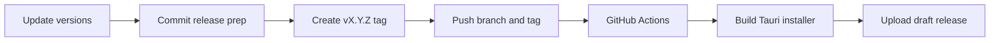

# Release Guide

DazPilot uses GitHub Actions to build, package, and publish Windows desktop installers for GitHub Releases.

## Release Flow



## Before Tagging

Update the application version in both files:

| File | Field |
| --- | --- |
| `package.json` | `version` |
| `src-tauri/tauri.conf.json` | `version` |

Run the local checks:

```powershell
npm run check
```

If you have Rust or bridge changes, also run:

```powershell
cargo test
npm run plugin:rebuild
```

## Tag A Release

This repository currently uses `master` as the primary branch.

```powershell
git add package.json src-tauri/tauri.conf.json
git commit -m "chore: bump version to v0.1.0"
git tag v0.1.0
git push origin master
git push origin v0.1.0
```

After the tag is pushed, GitHub Actions starts the release job.

## Required GitHub Settings

### Workflow Permissions

GitHub Actions needs permission to create releases and upload installer assets.

1. Open the repository on GitHub.
2. Go to Settings -> Actions -> General.
3. Find Workflow permissions.
4. Select Read and write permissions.
5. Save the setting.

### Installer Signing Secrets

Unsigned Windows installers can trigger SmartScreen warnings. For production releases, add the Tauri signing secrets in GitHub:

| Secret | Purpose |
| --- | --- |
| `TAURI_SIGNING_PRIVATE_KEY` | Tauri private signing key |
| `TAURI_SIGNING_PRIVATE_KEY_PASSWORD` | Password for the private key |

Then confirm the signing environment variables are enabled in `.github/workflows/release.yml`.

## Prebuilt Bridge DLLs

The Daz Studio SDK is proprietary, so the GitHub runner cannot download it or build the bridge plugin from source. Release builds rely on locally compiled DLLs bundled into `src-tauri/resources/`.

To update them:

1. Make C++ changes in `plugins/daz3d-bridge/`.
2. Build locally:

```powershell
npm run plugin:rebuild
```

3. Confirm the expected resource DLLs were updated:

```text
src-tauri/resources/DazPilotBridge.dll
src-tauri/resources/VibeBridgePlugin.dll
```

4. Stage, commit, and push those resource DLLs with the release prep.

The repository ignore rules are configured to keep normal build DLLs out of git while allowing the release resources that Tauri needs.

## What The Pipeline Does

On every `v*` tag, the release workflow:

1. Verifies required DLL and runtime resources are present.
2. Installs Node and Rust dependencies.
3. Compiles the TypeScript/Vite frontend.
4. Bundles resources through Tauri.
5. Produces the Windows installer.
6. Uploads the installer to a draft GitHub Release.
