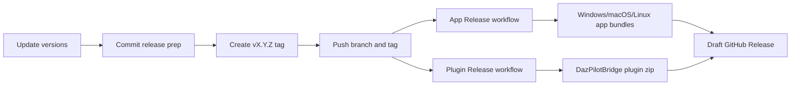

# Release Guide

DazPilot uses separate GitHub Actions workflows for app releases and Daz Studio bridge plugin releases.

The desktop app is built on Windows, macOS, and Linux. The current native bridge plugin artifact is Windows-only because the C++ plugin uses the Windows Daz SDK layout and a Winsock TCP server. macOS/Linux app bundles can still be built, but native Daz bridge support on those platforms needs a platform-specific plugin build.

## Release Flow



## Before Tagging

Update the application version in both files:

| File                        | Field     |
| --------------------------- | --------- |
| `package.json`              | `version` |
| `src-tauri/tauri.conf.json` | `version` |

Run the local checks:

```powershell
npm run check
```

If you have Rust or bridge changes, also run:

```powershell
cargo test
npm run plugin:rebuild
```

To build and copy the bridge directly into the Daz Studio plugins folder, use:

```powershell
npm run plugin:rebuild:deploy
```

That deploy step writes to `C:\Program Files\DAZ 3D\DAZStudio4\plugins` by default and may require an elevated shell. You can override the destination with CMake:

```powershell
cmake -S plugins\daz3d-bridge -B plugins\daz3d-bridge\build `
  -DDAZPILOT_DEPLOY_TO_DAZ=ON `
  -DDAZ_PLUGINS_DIR="D:\MyDazInstall\plugins"
cmake --build plugins\daz3d-bridge\build --config Release
```

## Tag A Release

This repository currently uses `master` as the primary branch.

```powershell
git add package.json src-tauri/tauri.conf.json
git commit -m "chore: bump version to v0.1.0"
git tag v0.1.0
git push origin master
git push origin v0.1.0
```

After the tag is pushed, GitHub Actions starts:

| Workflow         | Purpose                                                                        |
| ---------------- | ------------------------------------------------------------------------------ |
| `CI`             | Pull request and branch checks for frontend, Rust core, and bridge DLL exports |
| `App Release`    | Builds and uploads Tauri app bundles for Windows, macOS, and Linux             |
| `Plugin Release` | Packages the prebuilt Windows `DazPilotBridge.dll` into a bridge plugin zip    |

## Required GitHub Settings

### Workflow Permissions

GitHub Actions needs permission to create releases and upload installer assets.

1. Open the repository on GitHub.
2. Go to Settings -> Actions -> General.
3. Find Workflow permissions.
4. Select Read and write permissions.
5. Save the setting.

### Installer Signing Secrets

Unsigned Windows installers can trigger SmartScreen warnings. For production releases, add the Tauri signing secrets in GitHub:

| Secret                               | Purpose                      |
| ------------------------------------ | ---------------------------- |
| `TAURI_SIGNING_PRIVATE_KEY`          | Tauri private signing key    |
| `TAURI_SIGNING_PRIVATE_KEY_PASSWORD` | Password for the private key |

Then confirm the signing environment variables are enabled in `.github/workflows/app-release.yml`.

## Bridge Plugin Releases

The Daz Studio SDK is proprietary, so the GitHub runner cannot download it or build the bridge plugin from source. Release builds rely on locally compiled DLLs bundled into `src-tauri/resources/`.

To update them:

1. Make C++ changes in `plugins/daz3d-bridge/`.
2. Build locally:

```powershell
npm run plugin:rebuild
```

3. Confirm the expected resource DLLs were updated:

```text
src-tauri/resources/DazPilotBridge.dll
```

4. Stage, commit, and push the resource DLL with the release prep.

The repository ignore rules are configured to keep normal build DLLs out of git while allowing the release resources that Tauri needs.

GitHub Actions never downloads, stores, extracts, or builds against the Daz Studio SDK. The SDK stays local because it is proprietary and should not be redistributed through this repository or CI. The `Plugin Release` workflow only packages the committed `src-tauri/resources/DazPilotBridge.dll`.

## What The Pipeline Does

On every `v*` tag, the app release workflow:

1. Verifies required DLL and runtime resources are present.
2. Installs Node and Rust dependencies.
3. Compiles the TypeScript/Vite frontend.
4. Bundles resources through Tauri.
5. Produces Windows, macOS, and Linux bundles.
6. Uploads the bundles to a draft GitHub Release.

On every `v*` or `plugin-v*` tag, the plugin release workflow:

1. Verifies the bridge DLL exists.
2. Checks that the DLL exports Daz Studio's required `getSDKVersion` and `getPluginDefinition` symbols.
3. Packages the DLL and bridge README into `DazPilotBridge-<tag>.zip`.
4. Uploads the plugin zip to a draft GitHub Release.
