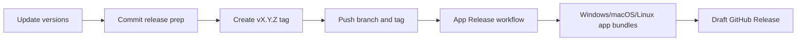

# Release Guide

DazPilot uses GitHub Actions workflows for app releases.

The desktop app is built on Windows, macOS, and Linux. Bridge plugin source at `plugins/daz3d-bridge/`.

## Release Flow



## Before Tagging

Update the application version in both files:

| File                        | Field     |
| --------------------------- | --------- |
| `package.json`              | `version` |
| `src-tauri/tauri.conf.json` | `version` |

Run the local checks:

```powershell
npm run check
```

If you have Rust changes, also run:

```powershell
cargo test
```

## Tag A Release

This repository currently uses `master` as the primary branch.

```powershell
git add package.json src-tauri/tauri.conf.json
git commit -m "chore: bump version to v0.5.1"
git tag v0.1.0
git push origin master
git push origin v0.1.0
```

After the tag is pushed, GitHub Actions starts:

| Workflow         | Purpose                                                                        |
| ---------------- | ------------------------------------------------------------------------------ |
| `CI`             | Pull request and branch checks for frontend and Rust core |
| `App Release`    | Builds and uploads Tauri app bundles for Windows, macOS, and Linux             |

## Required GitHub Settings

### Workflow Permissions

GitHub Actions needs permission to create releases and upload installer assets.

1. Open the repository on GitHub.
2. Go to Settings -> Actions -> General.
3. Find Workflow permissions.
4. Select Read and write permissions.
5. Save the setting.

### Installer Signing Secrets

Unsigned Windows installers can trigger SmartScreen warnings. For production releases, add the Tauri signing secrets in GitHub:

| Secret                               | Purpose                      |
| ------------------------------------ | ---------------------------- |
| `TAURI_SIGNING_PRIVATE_KEY`          | Tauri private signing key    |
| `TAURI_SIGNING_PRIVATE_KEY_PASSWORD` | Password for the private key |

Then confirm the signing environment variables are enabled in `.github/workflows/app-release.yml`.

## What The Pipeline Does

On every `v*` tag, the app release workflow:

1. Installs Node and Rust dependencies.
2. Compiles the TypeScript/Vite frontend.
3. Bundles resources through Tauri.
4. Produces Windows, macOS, and Linux bundles.
5. Uploads the bundles to a draft GitHub Release.
